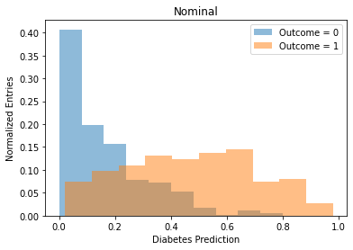

# Implementing a Biased Random Forest
Learning from unbalanced classes is a problem common to many datasets. The [Biased Random Forest](https://ieeexplore.ieee.org/document/8541100) (BRAF) approach is an algorithim-level approach that aims to address the imbalance in an input data set and improve performance. A walk-through of a complete implementation is provided for a single forest. A k-fold validation (k=10) is then performed to evaluate the ensemble performance of the method

### Load data


```python
from backendBRAF import *

data_raw = pd.read_csv('/home/btannenw/Desktop/life/challenges/BRAF/ML_Technical/diabetes.csv')
data_clean = cleanAndImpute( data_raw ) # impute any missing values
data_scaled = standardScaleVariables( data_clean) # scale data
```

### Explore data 


```python
nBins = 20
plotVar = 'SkinThickness'

for variable in data_scaled.columns.to_list():
    if variable == plotVar:
        plotOneVariable(data_raw, variable, bins=nBins)    # first, plot raw data
        plotOneVariable(data_clean, variable, bins=nBins)  # second, plot data after imputation
        plotOneVariable(data_scaled, variable, bins=nBins) # third, plot data after scaling+imputation

```


### Make testing, training sets


```python
# create testing and training sets
train1, test1, train0, test0 = returnTestTrainSplit(data_scaled, testingFraction=0.15)

# build training set
T = train0.copy()
T = T.append(train1.copy())
T = T.sample(frac=1.)
print("Training set: {} rows".format(len(T)))

# build testing set
T_test = test0.copy()
T_test = T_test.append(test1.copy())
T_test = T_test.sample(frac=1.)
print("Testing set: {} rows".format(len(T_test)))
```

    268 227 227 41
    500 425 425 75
    Training set: 652 rows
    Testing set: 116 rows


### Make critical set


```python
kNN = 10 # k-nearest neighbors parameter

Tc = buildCriticalSet(train0, train1, kNN)
print("Critial set: {} rows".format(len(Tc)))
```

    Critial set: 493 rows


### Train A Single Random Forest


```python
s = 100 # forest size
p = 0.5 # forest fraction trained on critical set

nominalTrees = int(s*(1-p))
criticalTrees = s - nominalTrees
print("Nominal trees: {}, Critical Trees: {}".format(nominalTrees, criticalTrees))

nominal_forest = trainRandomForest( T, max_depth=3, min_size=10, nTrees=nominalTrees, name='Nominal')
critical_forest = trainRandomForest( Tc, max_depth=3, min_size=10, nTrees=criticalTrees, name='Critical')
```

    Nominal trees: 50, Critical Trees: 50
    Training Nominal Forest
    Training Critical Forest


### Evaluate/Compare Results over Forest Subsets


```python
# nominal training set performance
evaluateForest( 'Nominal', nominal_forest, T_test)

# critical training set performance
evaluateForest( 'Critical', critical_forest, T_test)

# combined performance
combined_forest = nominal_forest + critical_forest
a,p,c = evaluateForest( 'Combined', combined_forest, T_test)
```

### Visualize Forest Predictions


```python
T_pred_0 = makeBaggingPredictions( T, nominal_forest)
T_pred_1 = makeBaggingPredictions( T, critical_forest)
T_pred_2 = makeBaggingPredictions( T, nominal_forest+critical_forest )

drawPredictionPlot( T_pred_0, 'Nominal', saveDir='.')
drawPredictionPlot( T_pred_1, 'Critical-Only', saveDir='.')
drawPredictionPlot( T_pred_2, 'BRAF', saveDir='.')
```





### ROC Curves


```python
a1 = plotROC('Nominal', T_pred_0, 'blue')
a2 = plotROC('Critical-Only', T_pred_1, 'red')
a3 = plotROC('BRAF', T_pred_2, 'green')
plt.show()
```


### Precision-Recall Curves


```python
pr1 = plotPRC('Nominal', T_pred_0, 'blue')
pr2 = plotPRC('Critical-Only', T_pred_1, 'red')
pr3 = plotPRC('BRAF', T_pred_2, 'green')
plt.show()
```


# Repeat Using k-Fold Validation


```python
nFolds = 10
kNN = 10 # k-nearest neighbors parameter
s = 100 # forest size
p = 0.5 # forest fraction trained on critical set

data_scaled = data_scaled.sample(frac=1., replace=False)
folds = [ data_scaled[ int((f/nFolds)*len(data_scaled)) : int(((f+1)/nFolds)*len(data_scaled))] for f in range(0,nFolds)]
results = kfoldResultsDict()

for iFold in np.arange(0, nFolds):
    
    print("======== {}th k-Fold ========".format(iFold))

    # *** 0. Initialize each iteration
    T_test = folds[iFold]
    T = None
    Tc = None
    
    # *** 1. Create n-1 fold for training
    for jFold in np.arange(0, len(folds)):
        # skip fold held apart for testing
        if iFold == jFold:
            continue
            
        # set T if first training fold
        if T is None:
            T = folds[jFold]
        else: # append folds to existing set
            T = T.append(folds[jFold])
    print("Training set: {} rows".format(len(T)))
    print("Testing set: {} rows".format(len(T_test)))
    
    # *** 2. Create critical set
    Tc = buildCriticalSet( T[ T.Outcome==0], T[ T.Outcome==1], kNN)
    print("Critial set: {} rows".format(len(Tc)))
    
    # *** 3. Create and train forest
    nominalTrees = int(s*(1-p))
    criticalTrees = s - nominalTrees
    print("Nominal trees: {}, Critical Trees: {}".format(nominalTrees, criticalTrees))

    nominal_forest = trainRandomForest( T, max_depth=3, min_size=10, nTrees=nominalTrees, name='Nominal')
    critical_forest = trainRandomForest( Tc, max_depth=3, min_size=10, nTrees=criticalTrees, name='Critical')

    # *** 4. Evaluate and store simple quantites
    # training set
    acc_nom, prec_nom, rec_nom = evaluateForest('Nominal-Only', nominal_forest, T)
    acc_crit, prec_crit, rec_crit = evaluateForest('Critical-Only', critical_forest, T)
    acc_braf, prec_braf, rec_braf = evaluateForest('BRAF', (nominal_forest + critical_forest), T)
    # testing set
    acc_nom_t, prec_nom_t, rec_nom_t = evaluateForest('Nominal-Only', nominal_forest, T_test)
    acc_crit_t, prec_crit_t, rec_crit_t = evaluateForest('Critical-Only', critical_forest, T_test)
    acc_braf_t, prec_braf_t, rec_braf_t = evaluateForest('BRAF', (nominal_forest + critical_forest), T_test)

    # *** 5. Store predictions for AUC/ AUPRC
    Tt_pred_nom  = makeBaggingPredictions( T_test, nominal_forest)
    Tt_pred_crit = makeBaggingPredictions( T_test, critical_forest)
    Tt_pred_braf = makeBaggingPredictions( T_test, (nominal_forest + critical_forest) )

    T_pred_nom  = makeBaggingPredictions( T, nominal_forest)
    T_pred_crit = makeBaggingPredictions( T, critical_forest)
    T_pred_braf = makeBaggingPredictions( T, (nominal_forest + critical_forest) )

    # *** 6A. Make AUROC comparison plot (train)
    auc_nom, auc_crit, auc_braf = compareCurves( T_pred_nom, T_pred_crit, T_pred_braf, iFold, 'AUC', name='train')
    
    # *** 6B. Make AUROC comparison plot (test)
    auc_nom_t, auc_crit_t, auc_braf_t = compareCurves( Tt_pred_nom, Tt_pred_crit, Tt_pred_braf, iFold, 'AUC', name='test')

    # *** 7A. Make AUPRC comparison plot (train)
    auprc_nom, auprc_crit, auprc_braf = compareCurves( T_pred_nom, T_pred_crit, T_pred_braf, iFold, 'AUPRC', name='train')
    
    # *** 7B. Make AUPRC comparison plot (test)
    auprc_nom_t, auprc_crit_t, auprc_braf_t = compareCurves( Tt_pred_nom, Tt_pred_crit, Tt_pred_braf, iFold, 'AUPRC', name='test')

    # *** 8. Store results
    storeFoldResults(results, 'nominal', acc_nom_t, prec_nom_t, rec_nom_t, auc_nom_t, auprc_nom_t, iFold) # nominal-only
    storeFoldResults(results, 'critical', acc_crit_t, prec_crit_t, rec_crit_t, auc_crit_t, auprc_crit_t, iFold) # critical-only
    storeFoldResults(results, 'BRAF', acc_braf_t, prec_braf_t, rec_braf_t, auc_braf_t, auprc_braf_t, iFold) # BRAF-only
    storeFoldResults(results, 'nominal_train', acc_nom, prec_nom, rec_nom, auc_nom, auprc_nom, iFold) # nominal-only
    storeFoldResults(results, 'critical_train', acc_crit, prec_crit, rec_crit, auc_crit, auprc_crit, iFold) # critical-only
    storeFoldResults(results, 'BRAF_train', acc_braf, prec_braf, rec_braf, auc_braf, auprc_braf, iFold) # BRAF-only
    
    # *** 9. Quick Print
    print("[BRAF] Train- Accuracy: {:.2f}%, Recall: {:.2f}%, Precision: {:.2f}%, , AUROC: {:.3f}, AUPRC: {:.3f}".format(acc_braf, rec_braf, prec_braf, auc_braf, auprc_braf))
    print("[BRAF] Test-  Accuracy: {:.2f}%, Recall: {:.2f}%, Precision: {:.2f}%, , AUROC: {:.3f}, AUPRC: {:.3f}".format(acc_braf_t, rec_braf_t, prec_braf_t, auc_braf_t, auprc_braf_t))
```

    ======== 0th k-Fold ========
    Training set: 692 rows
    Testing set: 76 rows
    Critial set: 514 rows
    Nominal trees: 50, Critical Trees: 50
    Training Nominal Forest
    Training Critical Forest


    [BRAF] Train- Accuracy: 80.20%, Recall: 59.04%, Precision: 80.77%, , AUROC: 0.542, AUPRC: 0.695
    [BRAF] Test-  Accuracy: 84.21%, Recall: 57.89%, Precision: 73.33%, , AUROC: 0.488, AUPRC: 0.377
    ======== 1th k-Fold ========
    Training set: 691 rows
    Testing set: 77 rows
    Critial set: 523 rows
    Nominal trees: 50, Critical Trees: 50
    Training Nominal Forest
    Training Critical Forest


    [BRAF] Train- Accuracy: 80.61%, Recall: 60.32%, Precision: 81.72%, , AUROC: 0.541, AUPRC: 0.691
    [BRAF] Test-  Accuracy: 79.22%, Recall: 56.25%, Precision: 50.00%, , AUROC: 0.534, AUPRC: 0.374
    ======== 2th k-Fold ========
    Training set: 691 rows
    Testing set: 77 rows
    Critial set: 508 rows
    Nominal trees: 50, Critical Trees: 50
    Training Nominal Forest
    Training Critical Forest


    [BRAF] Train- Accuracy: 80.46%, Recall: 56.25%, Precision: 81.82%, , AUROC: 0.542, AUPRC: 0.707
    [BRAF] Test-  Accuracy: 77.92%, Recall: 46.43%, Precision: 86.67%, , AUROC: 0.450, AUPRC: 0.582
    ======== 3th k-Fold ========
    Training set: 691 rows
    Testing set: 77 rows
    Critial set: 526 rows
    Nominal trees: 50, Critical Trees: 50
    Training Nominal Forest
    Training Critical Forest


    [BRAF] Train- Accuracy: 80.32%, Recall: 48.94%, Precision: 87.79%, , AUROC: 0.473, AUPRC: 0.699
    [BRAF] Test-  Accuracy: 64.94%, Recall: 30.30%, Precision: 71.43%, , AUROC: 0.433, AUPRC: 0.641
    ======== 4th k-Fold ========
    Training set: 691 rows
    Testing set: 77 rows
    Critial set: 520 rows
    Nominal trees: 50, Critical Trees: 50
    Training Nominal Forest
    Training Critical Forest


    [BRAF] Train- Accuracy: 81.62%, Recall: 59.09%, Precision: 83.63%, , AUROC: 0.531, AUPRC: 0.723
    [BRAF] Test-  Accuracy: 74.03%, Recall: 46.15%, Precision: 66.67%, , AUROC: 0.478, AUPRC: 0.528
    ======== 5th k-Fold ========
    Training set: 692 rows
    Testing set: 76 rows
    Critial set: 518 rows
    Nominal trees: 50, Critical Trees: 50
    Training Nominal Forest
    Training Critical Forest


    [BRAF] Train- Accuracy: 80.20%, Recall: 55.14%, Precision: 82.72%, , AUROC: 0.514, AUPRC: 0.677
    [BRAF] Test-  Accuracy: 81.58%, Recall: 52.00%, Precision: 86.67%, , AUROC: 0.494, AUPRC: 0.564
    ======== 6th k-Fold ========
    Training set: 691 rows
    Testing set: 77 rows
    Critial set: 502 rows
    Nominal trees: 50, Critical Trees: 50
    Training Nominal Forest
    Training Critical Forest


    [BRAF] Train- Accuracy: 81.04%, Recall: 57.20%, Precision: 81.82%, , AUROC: 0.525, AUPRC: 0.692
    [BRAF] Test-  Accuracy: 72.73%, Recall: 46.88%, Precision: 78.95%, , AUROC: 0.465, AUPRC: 0.662
    ======== 7th k-Fold ========
    Training set: 691 rows
    Testing set: 77 rows
    Critial set: 519 rows
    Nominal trees: 50, Critical Trees: 50
    Training Nominal Forest
    Training Critical Forest


    [BRAF] Train- Accuracy: 80.75%, Recall: 57.14%, Precision: 83.33%, , AUROC: 0.539, AUPRC: 0.655
    [BRAF] Test-  Accuracy: 75.32%, Recall: 39.13%, Precision: 64.29%, , AUROC: 0.450, AUPRC: 0.532
    ======== 8th k-Fold ========
    Training set: 691 rows
    Testing set: 77 rows
    Critial set: 517 rows
    Nominal trees: 50, Critical Trees: 50
    Training Nominal Forest
    Training Critical Forest


    [BRAF] Train- Accuracy: 80.90%, Recall: 57.81%, Precision: 81.07%, , AUROC: 0.527, AUPRC: 0.708
    [BRAF] Test-  Accuracy: 77.92%, Recall: 58.06%, Precision: 81.82%, , AUROC: 0.516, AUPRC: 0.632
    ======== 9th k-Fold ========
    Training set: 691 rows
    Testing set: 77 rows
    Critial set: 511 rows
    Nominal trees: 50, Critical Trees: 50
    Training Nominal Forest
    Training Critical Forest


    [BRAF] Train- Accuracy: 79.31%, Recall: 49.79%, Precision: 81.69%, , AUROC: 0.505, AUPRC: 0.681
    [BRAF] Test-  Accuracy: 74.03%, Recall: 57.14%, Precision: 80.00%, , AUROC: 0.497, AUPRC: 0.680


### Compare Performance across k-Folds


```python
compareAcrossFolds(results, 'accuracy')
compareAcrossFolds(results, 'recall')
compareAcrossFolds(results, 'auc')
```

    accuracy (nominal_train): 78.26 +/- 0.79
    accuracy (critical_train): 79.98 +/- 0.74
    accuracy (BRAF_train): 80.54 +/- 0.58
    accuracy (nominal): 74.10 +/- 5.15
    accuracy (critical): 74.36 +/- 3.99
    accuracy (BRAF): 76.19 +/- 5.07
    recall (nominal_train): 44.16 +/- 1.24
    recall (critical_train): 66.30 +/- 7.10
    recall (BRAF_train): 56.07 +/- 3.64
    recall (nominal): 36.01 +/- 8.19
    recall (critical): 56.25 +/- 8.91
    recall (BRAF): 49.02 +/- 8.69
    auc (nominal_train): 0.46 +/- 0.01
    auc (critical_train): 0.59 +/- 0.04
    auc (BRAF_train): 0.52 +/- 0.02
    auc (nominal): 0.42 +/- 0.04
    auc (critical): 0.54 +/- 0.04
    auc (BRAF): 0.48 +/- 0.03


# Conclusions
The BRAF method does improve performance compared to a nominal training set without up-sampling of the critical points. The gain in improvement using the BRAF forest over a nominal forest when training on the Pima Diabetes dataset is statistically significant though not exceptionally large. This however could be due to the intrinsic differences between  classes in the dataset rather than a shortfall of the method; the authors note different performances for different data shapes in their original paper. 

#### Sources:
- https://ieeexplore.ieee.org/document/8541100

- Pandas User Manual: https://pandas.pydata.org/docs/user_guide/index.html

- https://machinelearningmastery.com/implement-decision-tree-algorithm-scratch-python/

- https://machinelearningmastery.com/roc-curves-and-precision-recall-curves-for-classification-in-python/

- https://stackoverflow.com/questions/17821458/random-number-from-histogram
